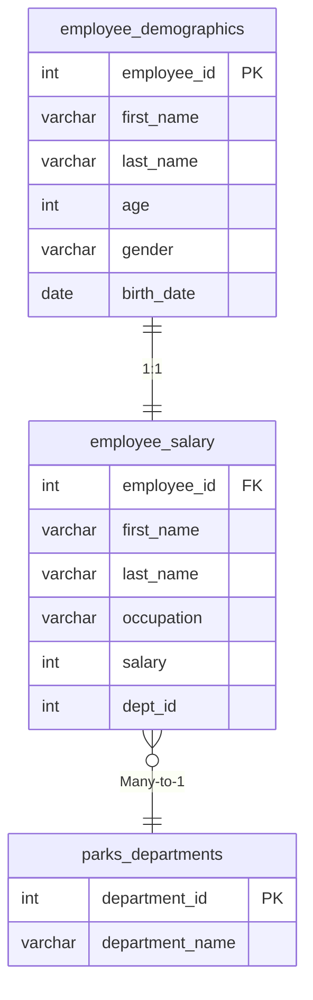

# Parks & Recreation – HR Analytics with SQL  
Multi-Table Joins • Data Cleaning • Workforce Insights • Window Functions • Stored Procedures

## Overview
This project analyzes a small but relational HR dataset from a fictional Parks & Recreation department.  
It demonstrates end-to-end SQL capability expected of a mid–senior level data analyst:

- Relational schema design  
- Data cleaning and standardization  
- Joins across demographic, salary, and department tables  
- HR and workforce analytics  
- Advanced SQL (window functions, CTEs, subqueries)  
- Production-style SQL features (stored procedures, triggers, scheduled events)  
- Clear modular SQL structure

The focus is on clean, readable SQL and business-oriented insights.

---

## Data Model (3 Tables)

| Table                   | Key Fields                               | Relationship                                |
|-------------------------|--------------------------------------------|---------------------------------------------|
| employee_demographics   | employee_id (PK), gender, age, birth_date | 1:1 → employee_salary                       |
| employee_salary         | employee_id (FK), occupation, salary, dept_id | Many:1 → parks_departments                |
| parks_departments       | department_id (PK), department_name        | Lookup table                                |

### ERD  


---

## Project Structure
```
parks-and-recreation-sql/
├── sql/
│   ├── 01_schema.sql               – table creation
│   ├── 02_data_cleaning.sql        – validation, standardization, fixes
│   ├── 03_hr_analysis.sql          – workforce and compensation insights
│   ├── 04_window_functions.sql     – ROW_NUMBER, RANK, DENSE_RANK
│   ├── 05_sql_skills_showcase.sql  – joins, CASE, string functions, subqueries
│   └── 06_advanced_features.sql    – procedures, triggers, events
├── data/                           – optional raw CSVs
└── README.md
```

---

## Key Deliverables
- Duplicate detection and demographic validation  
- Standardized gender, occupation, and department fields  
- Joins across demographics, salary, and departments  
- Salary benchmarks by department  
- Age-based workforce segmentation  
- Pay-band analysis using CASE expressions  
- Ranking employees using ROW_NUMBER / RANK / DENSE_RANK  
- Stored procedures for repeated salary lookups  
- Trigger to auto-populate demographic records after salary insert  
- Event scheduler to remove retirement-eligible employees

---

## Sample Business Insights
1. Recreation and Maintenance divisions have the largest headcount.  
2. Salary distribution is uneven across departments; supervisory roles consistently rank highest.  
3. Employees aged 60+ represent a small but identifiable retirement-risk segment.  
4. Gender representation is imbalanced in certain roles, indicating possible hiring or retention trends.  
5. High-salary roles cluster around leadership and specialized technical positions.

*(Insights are generated from the sample data model; they demonstrate patterns a real HR analyst would extract.)*

---

## Highlight Query
Ranking employees by salary within gender groups:

```sql
SELECT 
    dem.employee_id,
    dem.first_name,
    dem.last_name,
    dem.gender,
    sal.salary,
    ROW_NUMBER() OVER(PARTITION BY dem.gender ORDER BY sal.salary DESC) AS salary_rank
FROM employee_demographics dem
JOIN employee_salary sal
    ON dem.employee_id = sal.employee_id;
```

---

## How to Review
Open the `sql/` folder and review each file in numerical order.  
Execution is optional, all scripts are fully self-contained and documented for portfolio assessment.

---

## Skills Demonstrated
- Relational database design  
- Multi-table joins and lookup modeling  
- Data cleaning with SQL  
- Window functions and analytics  
- Stored procedures, triggers, and events  
- HR/People Analytics reporting  
- Modular, production-style SQL organization  

---

